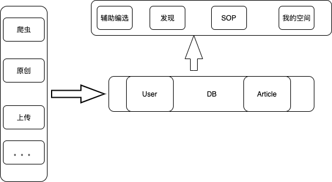

# minor-redesign
智能运营项目

后端基本模型

- 

# 模型
```
articleId: long
userId:long
importance:int
tags:[]
content:text
title：text
```

# 辅助编选
- 需要编辑的
  - 标签编辑
  - 文章编辑
  - 重要性编辑
  - article/userId={userId}&articleId={articleId}

- 需要显示的
  - 文章列表
  - article/userId={userId}
  - 接口定义
    - article/userId=

- 上传功能
  - 简单头部解析

